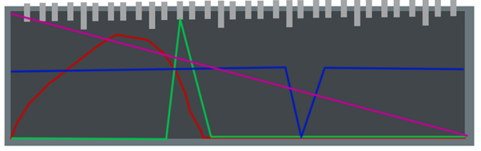

# Sense system

У игрока имеется виджет, который может быть открыт в любой момент игры. Однако, при открытии виджета и одновременном движении или беге, данные на виджете будут размытыми и ослабленными. Приседания и движение в приседе можно осуществлять без каких-либо проблем.


Разработчики хотят полностью отказаться от 2д виджетов


<figure><figcaption></figcaption></figure>

На виджете представлена горизонтальная шкала, которая отображает градусы относительно персонажа. На этой шкале отображаются графики, где более высокая линия указывает на более сильный запах. Важно отметить, что высота линии не означает близость запаха.

Каждый цвет на графике соответствует определенному запаху (для игроков с проблемами в распознавании цветов, цифры также указываются рядом с графиком). Целевые запахи могут быть выбраны из специального меню. Чем выше навык игрока в обнаружении запахов, тем больше количество доступных выборов.

В начале игры будут представлены простые запахи, такие как кровь, вода, пот и т.д. Позже игрок сможет обнаружить конкретные запахи определенных цветов или определенных врагов. Игрок может добавлять неограниченное количество этих запахов в список поиска и указывать им определенные цвета (возможно использование одного цвета для всех опасных запахов, например красный), значков или цифр.

\
